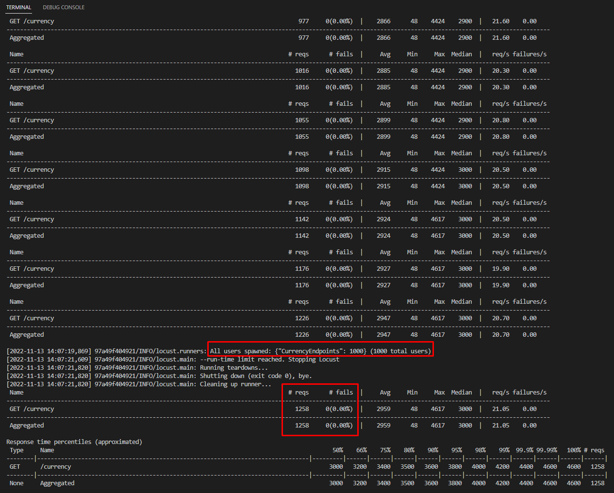

# Challenge Bravo: HURB

Conforme repositório hurbcom/challenge-bravo, a API criada retorna JSON, para conversão monetária e ainda dados de diversas moedas como preço, código e ainda lastro com dados reais e atualizados a cada 60 segundos. 

Obs.: após o fim do código percebi que para repositórios privados precisavamos fazer tudo na branch main como a documentação do desafio solicitava. Infelizmente para adequar acabei passando tudo para main e deletando as branches baseadas em gitflow.

## Stack utilizada
|Ferramenta      | Motivo
|----------------|-------------------------------|
| Python         | Linguagem de programação com alta legibilidade e pouco verbosa: auxilia na manutenção e criação de códigos com poucas linhas e maior produtividade.                    |
| FastApi        | Framework para criação de apis, documentação automatizada e validação de schemas com pydantic|
| Postgres        | Banco de dados|
| Alembic        | Ferramenta que abstrai maiores complexidades para criação de migrations|
| Pytest        | Framework de testes unitários python|
| Locust        | Framework para testes de carga python|

## Como rodar a aplicação
### Requisitos para execução:
1. Docker/docker-compose
2. Renomeie o arquivo ".env.example" para ".env"

### Passos para execução:
1.   `git clone https://github.com/apenasweber/bravo-weber`
2.  `cd challenge-bravo`
3.  `docker-compose up --build`

A aplicação também pode ser executada utilizando o make, com os seguintes comandos e auxiliares:
|Ferramenta      | Motivo
|----------------|-------------------------------|
| `make build`      | Builda a aplicação e aplica migrations alembic |
| `make run`      | Roda apenas container da api|
| `make up`      | Roda toda aplicação(api, banco de dados e coinbase_feeder)|
| `make down`      | Derruba a aplicação(api, banco de dados e coinbase_feeder)|
| `make bash`      | Acessa o terminal bash do container api|
| `make unit_tests`| Executa testes unitários |
| `make isort`      | Aplica isort em todo repositório para ordenar imports |
| `make black`      | Aplica o linter black |

## Testes
Foram criados testes unitários cobrindo todos endpoints da aplicação, convert/currency.
Para executa-los utilize no terminal, na raíz do projeto:
### 1. Testes unitários
```bash
docker compose run --service-ports -e --rm api bash -c "pytest ${test} --disable-warnings
```


### 2. Testes de carga
```bash
docker-compose up -d
```
```bash
docker ps
```
Agora copie o container id da api
```bash
docker exec -it {container_id da api} bash
```
```bash
locust -f app/tests/stress_tests/locustfile.py --headless -u 1000 -r 17 --run-time 1m --host http://127.0.0.1:8000
```


Obs.: o resultado dos testes de carga podem sofrer alterações ou falhar dependendo do seu firewall, qualidade de conexão, entre outros.

## Banco de Dados
O banco de dados possui 2 tabelas:

 - coinbase_currencies_public_api: moedas e cotações da api coinbase que podem ser acessadas no endpoint `'/currency'` [GET]
 - fictitious_currencies: tabela: moedas e cotação das moedas fictícias criadas pelo usuário no ednpoint `'/currency'` [POST]

## Endpoints

A documentação extensa de todo tipo de input e output pode ser encontrada em https://localhost/8000/docs conforme indicação de como executar a aplicação.

|Endpoint        |Método                 |Retorno                           |
|----------------|-------------------------------|-----------------------------|
|`'/currency'`   | GET                           |Retorna todas moedas do DB  |
|`'/currency/{currency_code}'` |GET            |Retorna cotação da moeda através de seu código            |
|`'/currency'`          |POST  | Cria moeda fictícia
|`'/currency/{currency_code}'`   | PUT        | Atualiza moeda específica no DB  |
|`'/currency/{currency_code}'`   | DELETE        | Deleta moeda específica no DB  |
|`'/convert'`   | GET        | Converte o valor de uma moeda baseada em outra moeda  |


